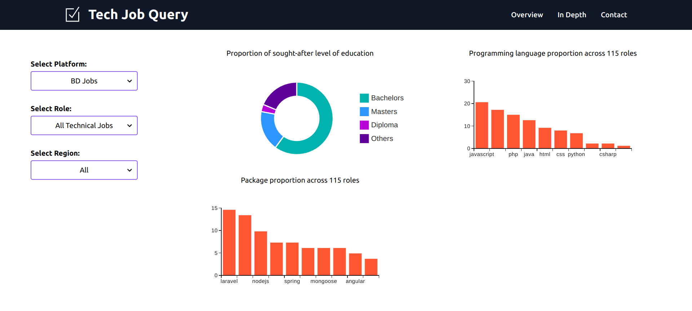

# Hi, I'm Mirza Mahfuj Hossain

Welcome to my Machine Learning Portfolio! This repository showcases a collection of 
machine learning projects in various domains, demonstrating my skills and expertise 
as a data scientist and machine learning engineer. Each project provides step-by-step 
instructions, code, and visualizations to showcase the data analysis and modeling 
techniques employed

## 🛠️ Skills & Tools

### **ML & AI**

### **Deployment, DevOps & Frameworks**

### **Programming Languages**

### **Familiar Platforms**

<!-- ## Table of Contents

- [Project 1: Automatic License Plate Recognition](https://github.com/tushar2704/Sales-for-Retail-and-Food-Services)
- [Project 2: Football Game Analysis using Computer Vision](https://github.com/m4hfuj/football-game-analysis)
- [Project 3: Bangladeshi Tech Job Listing](https://github.com/m4hfuj/football-game-analysis)
- [Project 4: Student ID Card validity checker](https://github.com/m4hfuj/Student-ID-card-validity-checker)
- [Project 5: Fine-tuning microsoft phi-2 model on medicine data](https://github.com/m4hfuj/Large-Language-Models/blob/main/Fine%20Tuning%20microsoft%20phi-2%20on%20medicine%20dataset.ipynb)

---
- [<ins><b>©2023 Mirza Mahfuj Hossain. All rights reserved</b></ins>]()
--- -->

### 🎯 Projects & Highlights

Welcome to my Machine Learning Portfolio! This repository showcases my skills and 
experience in the field of Machine Learning. Here, you will find a collection of 
projects and analyses that demonstrate my ability to extract insights and make 
data-driven decisions through Machine Learning.

### [🚍 Vehicle license plate recognition](https://github.com/m4hfuj/automatic-bangla-license-plate-recognition)

Tech Stack: Python, YOLOv8, PyQt5, opencv, PyTorch

Automatic License Plate Recognition (ALPR) is a system that detects and identifies 
license plates from real-time video footage. It employs YOLO object detection 
models to locate license plates and extract alphanumeric data. Applications 
include vehicle tracking and recording entry and exit times in a database.

<!--  -->
<!--  -->

### [⚽ Football game analysis using computer vision](https://github.com/m4hfuj/football-game-analysis)

This repository contains a robust pipeline for analyzing football game videos, focusing on 
object detection, tracking, team assignments, and ball control analysis. The program leverages 
advanced computer vision techniques to process game footage, delivering detailed insights 
through annotations and statistics.

<!--  -->
<!--  -->

### [🙂 Face detection and recognition using yolov8 facenet](https://github.com/m4hfuj/FaceStream/tree/version-6)

This Python project processes live video from a webcam or YouTube stream, detecting 
faces and applying filters in real time. It uses YOLOv8 for face detection,
InceptionResnetV1 (Facenet) for recognition, and Mediapipe for accurate landmark 
mapping. With an intuitive PyQt5 interface, users can input YouTube links, 
upload photos, and save recognized faces, enabling a seamless and interactive 
experience.

<!--  -->

### [🔎 Bangladeshi tech job data analysis from bdjobs](https://github.com/m4hfuj/bangladeshi-tech-job-query)

This project automates the collection of technical job data from BD Jobs using 
web scraping and stores it in a MySQL database. Job fields are classified using 
LLM-based text classification, while educational requirements, programming 
languages, and packages are identified using regular expressions. A dashboard 
visualizes the top 10 educational requirements, programming languages, and 
packages, with filtering options by job field.

<!--  -->

<!-- ### [Project 4: 🪪 Student ID Card validity checker](https://github.com/m4hfuj/Student-ID-card-validity-checker)

This project is designed to validate student ID cards using machine learning and 
web technologies. It involves collecting and processing ID card images and annotaing them, 
training an YOLO object detection model, and integrating it with a web application for 
real-time validation.

 -->

<!-- ### [Project 4: 🤖 Fine-tuning microsoft phi-2 model on medicine data](https://github.com/m4hfuj/Large-Language-Models/blob/main/Fine%20Tuning%20microsoft%20phi-2%20on%20medicine%20dataset.ipynb)

Fine-tuned the Microsoft Phi-2 model on medical data by adapting its pre-trained 
capabilities to domain-specific tasks like medical text classification and summarization. 
This allowed me to enhance the model's performance, leveraging its advanced natural 
language understanding for healthcare applications, allowing it to generate recommended 
medicine details based on disease symptoms. -->

## 🧮 Machine Learning / Deep Learning 

I have spent a lot of time diving deep into various machine learning and deep learning algorithms, 
learning both the theory behind them and how to implement them in code. This 
blend of knowledge has given me the ability to not only use these algorithms 
effectively but also tweak and adapt them to solve specific problems. Here is a 
list of the machine learning algorithms and techniques I am familiar with, 
highlighting the range of skills I have developed in this area.

- [Machine Learning Algorithms](https://github.com/m4hfuj/Machine-Learning-Algorithms): In this repository, 
  I have implemented fundamental machine learning algorithms from scratch, without using any libraries or 
  packages. It is a hands-on way I have explored the basics of these algorithms.

- [Computer Vision Algorithms](https://github.com/m4hfuj/Computer-Vision-Algorithms): This repository 
  contains some of the computer vision algorithms I have worked on, including image classification, 
  object detection, and image segmentation. These implementations use frameworks like PyTorch and 
  TensorFlow, which I have gained hands-on experience with.

- [Unsupervised Learning Algorithms](https://github.com/m4hfuj/unsupervised-learning): I have implemented 
  several unsupervised learning algorithms, including a recommendendation system. It is a project where I explore 
  how to handle and derive insights from data without labeled examples.

- [Large Language Models](https://github.com/m4hfuj/Large-Language-Models): This repository contains 
  code for loading, encoding, and fine-tuning large language models (LLMs). It reflects my work on 
  adapting pre-trained models for various natural language processing tasks.
    

<!-- ## 📜 Certificates

Here is some certificates that I achieved: -->

#### Machine Learning Specialization (DeepLearning.AI) [[View Certificate](https://coursera.org/share/1fe452302aaab3d09a03d8394e07db63)]

<!-- 

View it online: [Certificate Link](https://coursera.org/share/1fe452302aaab3d09a03d8394e07db63)

#### Data Science:

**Course: What is Data Science?** [[View Certificate](https://coursera.org/share/a4d919405211a9917d5d29cfed9c59c6)]

**Course: Tools for Data Science** [[View Certificate](https://coursera.org/share/2548a4c77d89bd3d14c66cb833818939)]

#### Projects:

**Deep Learning with PyTorch : Object Localization** [[View Certificate](https://coursera.org/share/34443c99168a26d83c717a936be6f69d)]

**Deep Learning with PyTorch : Image Segmentation** [[View Certificate](https://coursera.org/share/ab304e46f58e0a6ed8bdc9e4dedd3915)]

**Command Line in Linux** [[View Certificate](https://coursera.org/share/ce2bf70b6a149f69428c3f706f0e9b90)]

**Basic Image Classification with TensorFlow** [[View Certificate](https://coursera.org/share/d4e4f32a781f2aade35ed126eb2fe00a)]

 -->

## 📝 Author

[Mirza Mahfuj Hossain](https://github.com/m4hfuj)

📧 mhmirza.just@gmail.com  

🔗 [LinkedIn](https://www.linkedin.com/in/mirza-mahfuj-hossain/)

#### © 2024 Mirza Mahfuj Hossain. All rights reserved.
